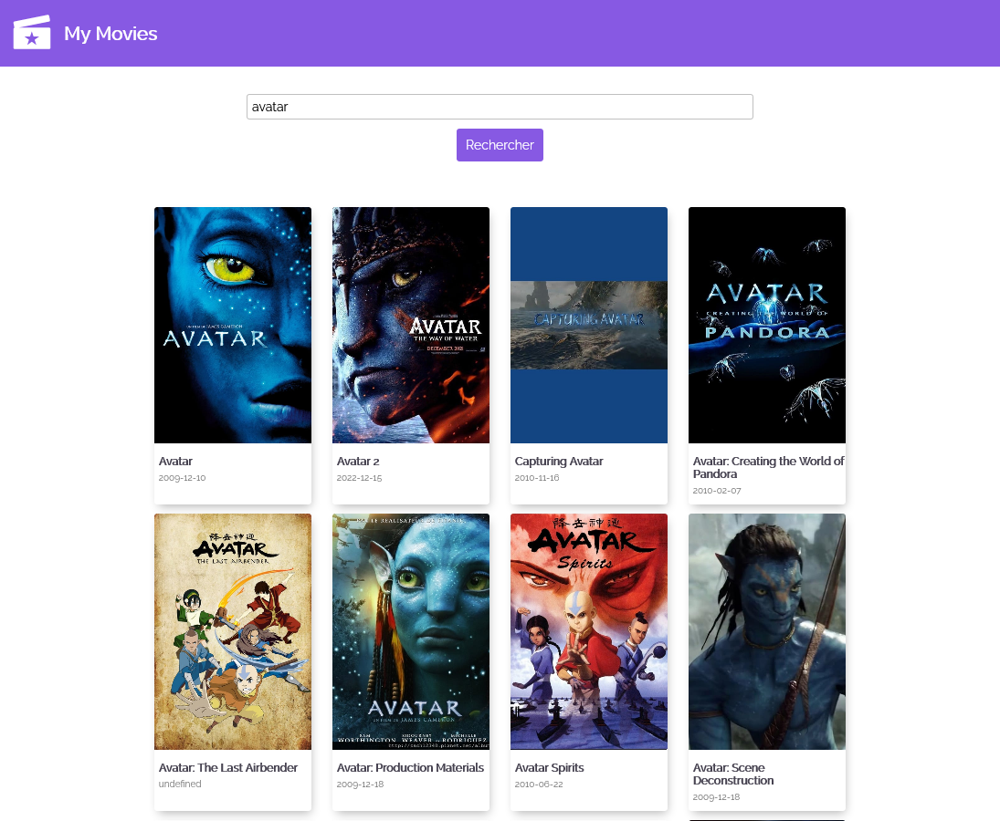

### Live version [here](https://vue-moviedb.vercel.app/#/).

# Vue MovieDB

## Détails

> Technos utilisées : HTML/CSS/JS/Vue.js

Projet en cours ...

Pour ce projet mon objectif était de réaliser une version Vue.js d'un projet déjà réalisé en Javascript Vanilla ([version JS](https://github.com/VirginieBouvarel/projets_perso/tree/main/movieDB_sandbox)\)). Il s'agit d'une mini application permettant d'interroger l'API MovieDB afin d'afficher des films correspondant aux mots clés saisis dans un champ de recherche.
